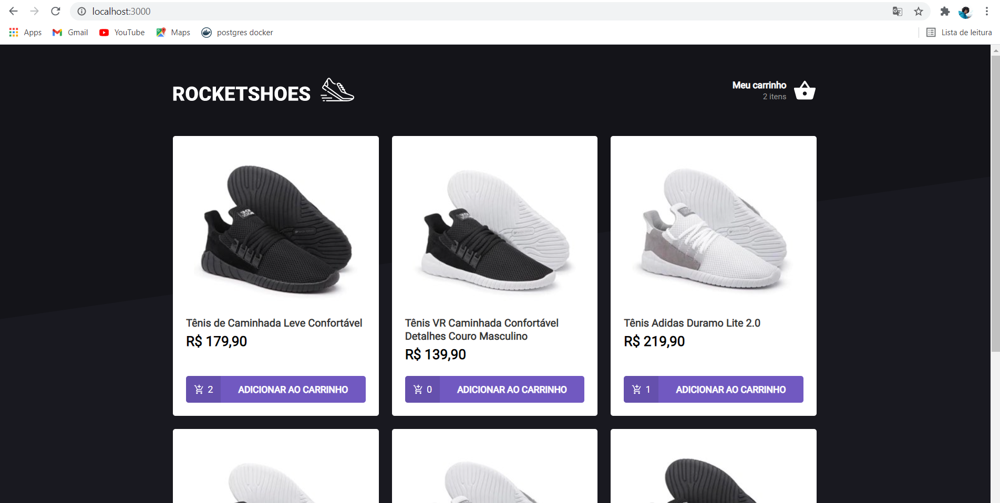
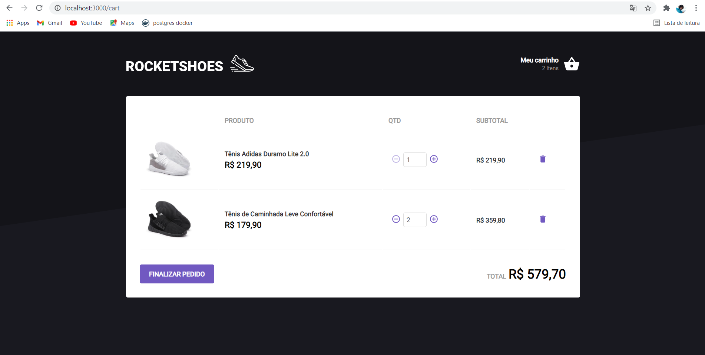

# 🚀👨🏾‍🚀 Journey-Ignite-Rocketseat-Module-02 -> Challenge-01-Creating-a-shopping-cart-hook

In this challenge the main objective was to create a shopping cart hook. There is a hook that implements the following features:

- Add a new product to the cart;
- Remove a product from the cart;
- Change the quantity of a product in the cart;
- Calculation of the sub-total and total cart prices;
- Inventory validation;
- Display of error messages;
- Between others.

